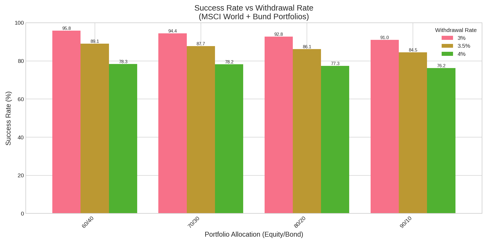
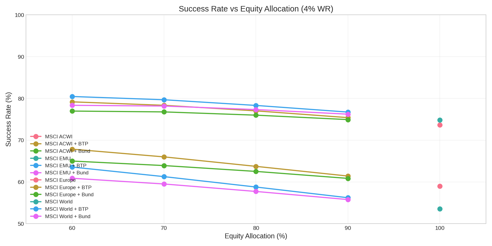
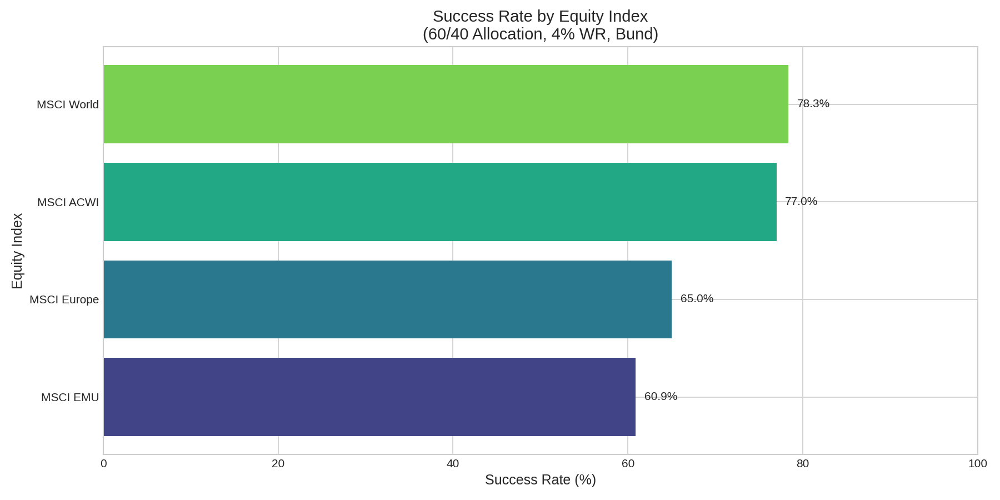
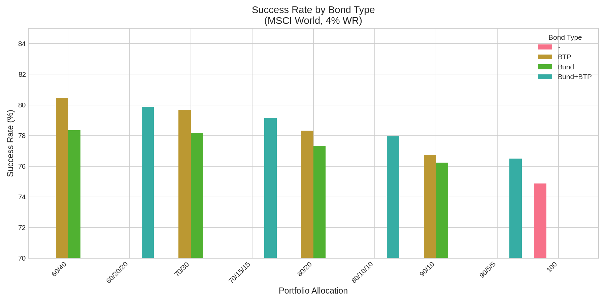
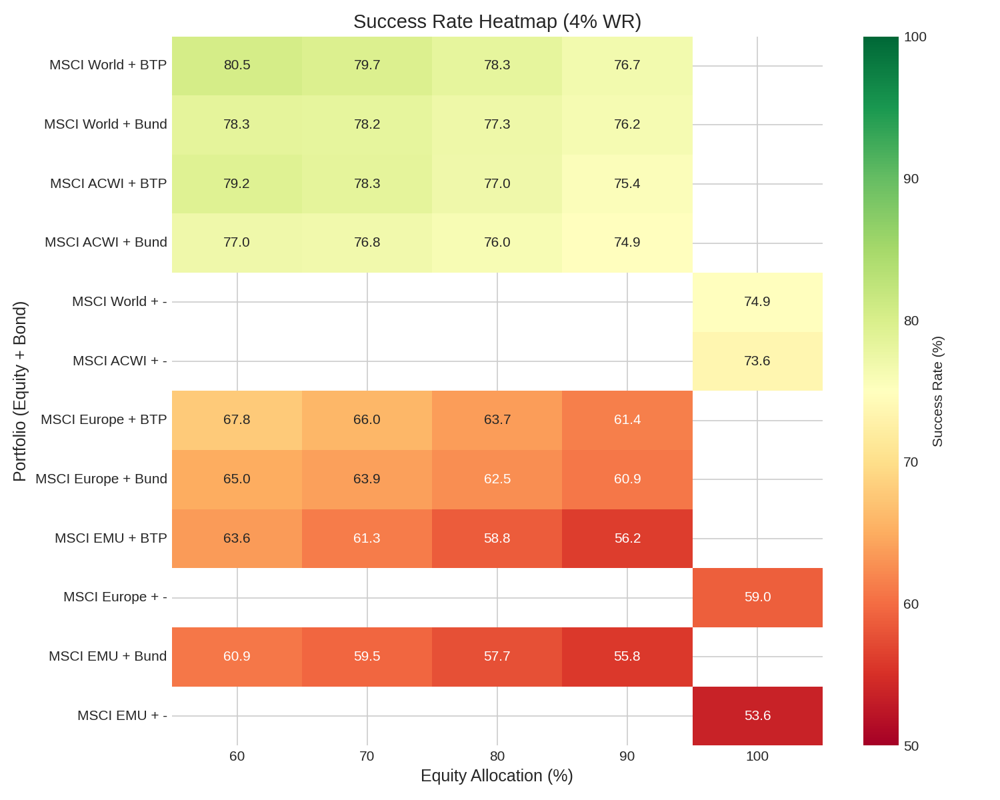
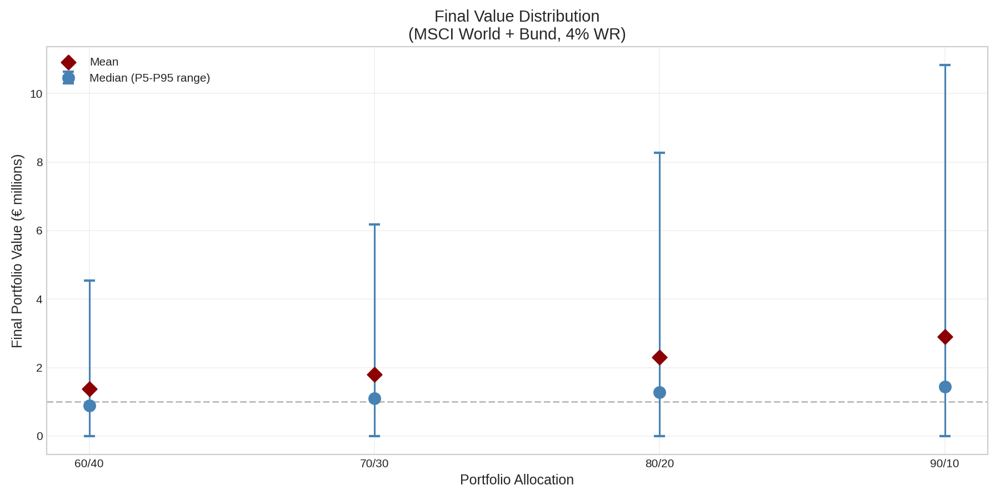
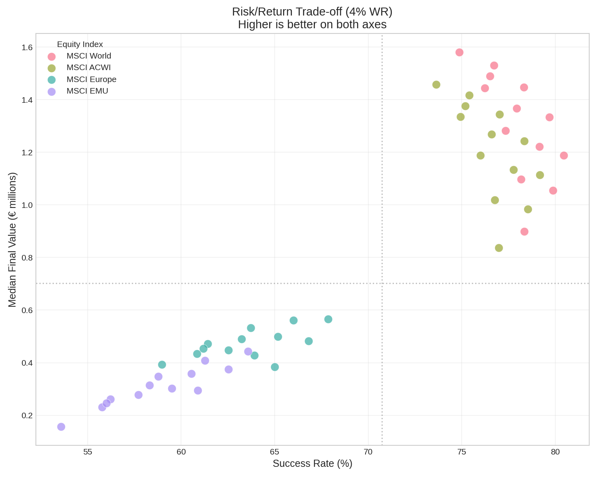
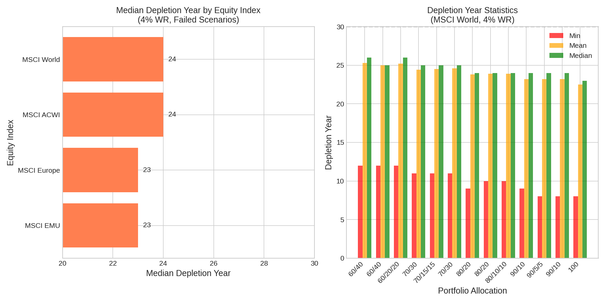
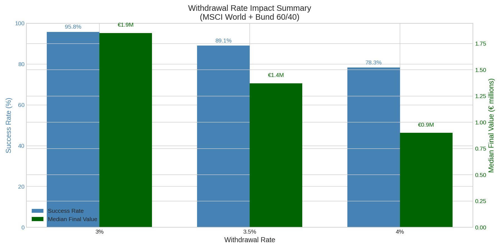

# Analysis Plots

Visualizations generated by `src/tools/plots.py` from `ANALYSIS_REGISTRY.csv` data.

**Note:** STOXX Europe 600 data (03xx notebooks) is excluded from all plots.

---

## 01 - Success Rate vs Withdrawal Rate



**Description:** Direct comparison of withdrawal rate impact (3%, 3.5%, 4%) on success rate for MSCI World + Bund portfolios.

**Data:** MSCI World + Bund, allocations 60/40, 70/30, 80/20, 90/10

**Key insights:**
- Moving from 4% to 3% WR increases success rate by ~17-19 percentage points
- At equal WR, more conservative allocations (60/40) tend to have slightly higher success rates
- 3% WR guarantees >90% success rate for all allocations

---

## 02 - Success Rate vs Allocation



**Description:** How success rate varies with equity percentage in the portfolio (from 60% to 100%).

**Data:** All equity indices with single bonds, 4% WR

**Key insights:**
- No linear relationship between equity % and success rate
- For global indices (World, ACWI), moderate allocations (60-70%) tend to perform better
- For European indices, the pattern is less defined
- 100% equity is not necessarily the optimal choice

---

## 03 - Success Rate by Equity Index



**Description:** Success rate comparison across different equity indices under equal conditions.

**Data:** 60/40 allocation, Bund, 4% WR

**Key insights:**
- MSCI World performs best (78.3%)
- MSCI ACWI is second (77.0%)
- Pure European indices (Europe, EMU) have significantly lower success rates (~61-65%)
- Global geographic diversification improves portfolio sustainability

---

## 04 - Success Rate by Bond Type



**Description:** Comparison between different bond types (German Bund, Italian BTP, mix) with same equity index.

**Data:** MSCI World, 4% WR, various allocations

**Key insights:**
- Italian BTPs tend to generate higher success rates than German Bunds
- Bund+BTP mix offers intermediate results
- The difference is more pronounced for allocations with higher bond weight
- Higher BTP yields compensate for credit risk in the analyzed period (2000-2025)

---

## 05 - Heatmap Success Rate



**Description:** Overview of all portfolio/allocation combinations in a single heatmap.

**Data:** All portfolios with single bonds, 4% WR

**Key insights:**
- Green colors = high success rate (>80%)
- Red colors = low success rate (<60%)
- Allows quick identification of optimal combinations
- Portfolios with global indices dominate the top (higher success rates)

---

## 06 - Final Value Distribution



**Description:** Distribution of final portfolio values after 30 years, showing median, mean, and P5-P95 range.

**Data:** MSCI World + Bund, 4% WR

**Key insights:**
- Mean is always higher than median (positive skewed distribution)
- P5-P95 range widens with more aggressive allocations
- More aggressive allocations generate higher median final values but with greater dispersion
- P5 (worst case) can be €0 for aggressive allocations (depleted portfolio)

---

## 07 - Risk/Return Trade-off



**Description:** Scatter plot showing the trade-off between success rate (safety) and median final value (return).

**Data:** All portfolios, 4% WR

**Key insights:**
- Each point represents a portfolio
- Upper right quadrant = optimal portfolios (high success rate AND high final value)
- Portfolios with global indices (World, ACWI) position better
- Trade-off exists: more aggressive portfolios have higher final values but lower success rates

---

## 08 - Depletion Year Analysis



**Description:** Analysis of failed scenarios: in which year the portfolio depletes.

**Data:** Portfolios with failed simulations, 4% WR

**Left panel:** Median depletion year by equity index
**Right panel:** Min, Mean, Median depletion year for MSCI World

**Key insights:**
- Depletion typically occurs between year 22 and 27 (on 30-year horizon)
- Worst case (Min) can be as early as year 7-14 for aggressive portfolios
- European indices have slightly earlier depletion years
- Useful for understanding "how much time do I have" in adverse scenarios

---

## 09 - WR Comparison Summary



**Description:** Summary of withdrawal rate impact on success rate and median final value.

**Data:** MSCI World + Bund 60/40, all available WRs

**Key insights:**
- Dual Y-axis: success rate (blue) and median final value (green)
- Lower WR = higher success rate AND higher final values (more residual capital)
- 3% WR leaves median capital of ~€1.85M after 30 years
- 4% WR leaves median capital of ~€0.9M after 30 years
- Trade-off between "safety" and "capital enjoyment"

---

## Regenerating Plots

To regenerate all plots:

```bash
./venv/bin/python src/tools/plots.py
```

Available options:
- `--input FILE`: Specify a different CSV file
- `--output-dir DIR`: Specify a different output directory
- `-v`: Verbose mode

---

## Methodological Notes

- **Data period:** 2000-2025
- **Simulations:** 100,000 Monte Carlo with block bootstrap (6-month blocks)
- **Horizon:** 30 years
- **Success rate:** % of simulations where portfolio survives 30 years
- **Inflation:** HICP Euro Area (lagged adjustment)
